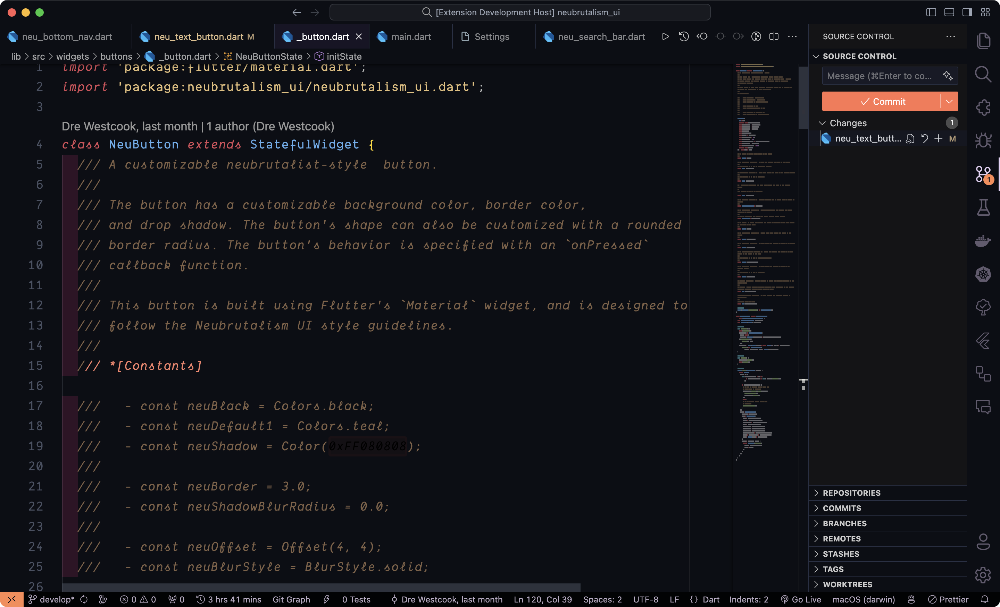
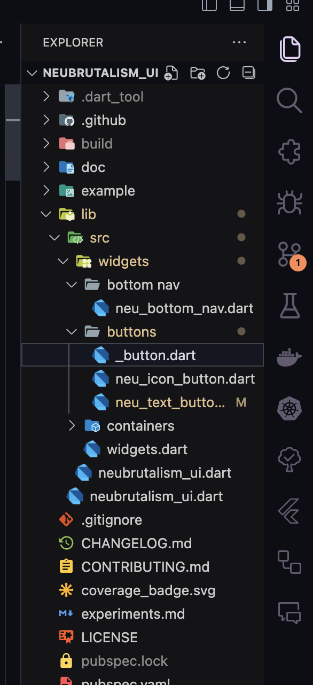

# Vibes-OnCampus - A Dark Theme Extension for VS Code.

<!-- 
## Screenshots

 -->

## About
Vibes-Oncampus is a meticulously crafted dark color theme for Visual Studio Code that aims to provide a visually pleasing and comfortable coding experience. The inspiration behind creating this theme stemmed from a desire to offer developers an alternative that resonates with a broader range of users, ensuring a harmonious vibe for all.

## Features

- **Aesthetic Appeal:** Vibes-Oncampus offers a carefully chosen color palette that combines readability with a touch of style, creating a visually appealing environment for coding.

- **Versatility:** Designed to cater to the preferences of a diverse user base, Vibes-Oncampus strives to be an inclusive theme suitable for a wide range of programming languages and frameworks.

- **Easy on the Eyes:** The theme is optimized for prolonged coding sessions, prioritizing legibility and reducing eye strain.

## Installation

1. Open the Extensions view (`Ctrl + Shift + X` or `Cmd + Shift + X` on macOS).
2. Search for "Vibes-Oncampus" and click "Install" on the theme by [Your Name].

Alternatively, you can install it from the [Visual Studio Code Marketplace](https://marketplace.visualstudio.com/items?itemName=DeeprajBaidya.oncampus-vibes).

1. Open the Command Palette (`Ctrl + Shift + P` or `Cmd + Shift + P` on macOS).
2. Type "Color Theme" and select "Preferences: Color Theme."
3. Choose "Vibes-Oncampus" from the list of available themes.

## Feedback

Your feedback is invaluable! If you encounter any issues or have suggestions for improvement, please [submit an issue](https://github.com/OnCampus-Community/vibes-on-campus). Contributions are also welcome; feel free to fork the repository and create a pull request.

## License

This theme is licensed under the [MIT License](LICENSE.md) - see the [LICENSE.md](LICENSE.md) file for details.

## Contributing
To Contribute to this Project see our [Contributing Guildelines](CONTRIBUTING.md)